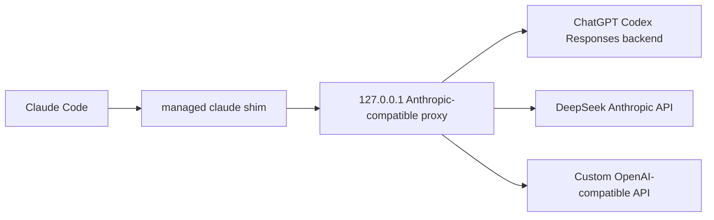

# CC Codex Proxy

<p align="center">
  <strong>Run Claude Code through ChatGPT Codex, DeepSeek, or a custom OpenAI-compatible endpoint from a local macOS menu bar app.</strong>
</p>

<p align="center">
  <a href="https://github.com/soulforger0/cc-codex-proxy/releases/latest/download/CCCodexProxy-macOS.dmg"><strong>Download latest DMG</strong></a>
  ·
  <a href="https://github.com/soulforger0/cc-codex-proxy/releases">Releases</a>
  ·
  <a href="docs/ARCHITECTURE.md">Architecture</a>
  ·
  <a href="CONTRIBUTING.md">Contributing</a>
  ·
  <a href="SECURITY.md">Security</a>
</p>

<p align="center">
  <a href="https://github.com/soulforger0/cc-codex-proxy/actions/workflows/ci.yml"></a>
  <a href="https://github.com/soulforger0/cc-codex-proxy/releases"></a>
  <a href="https://github.com/soulforger0/cc-codex-proxy/releases"></a>
  <a href="LICENSE"></a>
  
  
</p>

CC Codex Proxy is a local-only bridge for developers who prefer Claude Code's terminal workflow but want requests served by ChatGPT subscription Codex, DeepSeek, or a custom OpenAI-compatible endpoint. The app runs in the macOS menu bar, handles provider credentials, starts an Anthropic-compatible proxy on `127.0.0.1`, and temporarily routes new `claude` launches while the app is alive and healthy.

No manual `ANTHROPIC_*` setup is required for the app flow. Download the DMG, sign in, click **Start**, then open a fresh Claude Code session.

> [!IMPORTANT]
> ChatGPT Codex uses a subscription backend that is not a public OpenAI API contract. Upstream behavior can change. DeepSeek support uses DeepSeek's Anthropic-compatible API. Custom OpenAI-compatible endpoints are supported through user-provided base URLs and optional API keys; endpoint-specific model behavior may vary.

## Quick Start

The prebuilt app DMG is currently Apple Silicon (`arm64`) only. Intel users can install the CLI helper from source with Homebrew or build the app locally until universal app releases are available.

1. Download [CCCodexProxy-macOS.dmg](https://github.com/soulforger0/cc-codex-proxy/releases/latest/download/CCCodexProxy-macOS.dmg).
2. Open the DMG and drag `CCCodexProxy.app` into Applications.
3. Launch **CC Codex Proxy**.
4. Choose a provider:
   - **Codex**: click **Login** and complete ChatGPT OAuth in your browser.
   - **DeepSeek**: choose **DeepSeek**, paste your API key, and click **Save Key**.
   - **Custom**: choose **Custom**, enter an OpenAI-compatible endpoint URL, choose **Responses** or **Chat**, and optionally save an API key.
5. Close any currently running Claude Code sessions.
6. Click **Start** in the menu bar app.
7. Open a new Claude Code session normally:

```sh
claude
```

The app manages a temporary `claude` shim. New Claude Code sessions route through CC Codex Proxy only while the menu bar app is running and the proxy health check passes.

## Why This Exists

Claude Code speaks Anthropic's Messages API. For ChatGPT Codex and custom OpenAI-compatible Responses endpoints, CC Codex Proxy translates that Anthropic request/stream shape into the Responses API shape. For custom Chat Completions endpoints, it translates into OpenAI chat/completions and maps responses back to Anthropic messages. For DeepSeek, it forwards Anthropic-shaped requests to DeepSeek's Anthropic-compatible API after local model and request validation.



## Features

| Capability | What it does |
| --- | --- |
| Menu bar control | Start, stop, refresh status, and open logs from a native macOS app. |
| ChatGPT OAuth | Sign in from the app; tokens are stored locally under Application Support. |
| DeepSeek API keys | Store a DeepSeek API key locally or provide `DEEPSEEK_API_KEY`. |
| Custom OpenAI endpoints | Route to a user-provided OpenAI-compatible base URL with Responses or Chat Completions and an optional API key. |
| Temporary Claude routing | A managed shim injects proxy environment variables only when the app is alive and healthy. |
| Background agents | Claude Code background agents route through the proxy without requiring native Anthropic/Claude auth. |
| Local-only server | The proxy binds to `127.0.0.1` and does not expose a remote service. |
| Anthropic-compatible endpoints | Implements `/v1/messages` and `/v1/messages/count_tokens` for Claude Code. |
| Streaming translation | Streams Anthropic SSE back to Claude Code without buffering the full upstream response. |
| Transport fallback | In `auto` mode, tries Codex WebSocket first and falls back to HTTP SSE when needed. |
| Packaged helper | The SwiftUI app embeds the Rust/Tokio proxy helper at `CCCodexProxy.app/Contents/Helpers`. |

## What's New In 0.4.3

- The prebuilt Homebrew app cask is restricted to Apple Silicon (`arm64`) so Intel Macs do not install a non-universal app bundle that cannot launch.
- Release packaging now verifies DMG integrity, checksums, manifest architecture metadata, app/helper binary architecture, and app cask architecture requirements in one shared script.
- Release docs now distinguish the arm64 prebuilt app DMG from the source-built CLI formula.

## Compatibility

| Item | Status |
| --- | --- |
| macOS app | Supported on Apple Silicon (`arm64`). Releases ship as a drag-and-drop DMG. |
| Claude Code | Supported for new sessions launched after the proxy starts. Existing sessions must be closed first. |
| Claude Code background agents | Supported for proxy-routed `claude --bg` jobs while the app and local proxy are running. Native Claude auth is not required. |
| ChatGPT OAuth | Supported through the app or CLI. |
| DeepSeek API | Supported through app key storage, `DEEPSEEK_API_KEY`, or CLI key setup. |
| Custom OpenAI-compatible API | Supported with a configured base URL, `responses` or `chat-completions`, and optional `CUSTOM_OPENAI_API_KEY`. |
| Non-macOS desktop app | Not currently supported. |
| Developer ID signing / notarization | Not yet. Releases are currently ad-hoc signed. |

> [!NOTE]
> Because releases are not yet Developer ID signed or notarized, macOS may show a Gatekeeper warning on first launch. If that happens, right-click `CCCodexProxy.app` and choose **Open**.

## Install

### Homebrew

The app cask installs the same Apple Silicon (`arm64`) release DMG as the manual download path:

```sh
brew tap soulforger0/cc-codex-proxy https://github.com/soulforger0/cc-codex-proxy
brew install --cask soulforger0/cc-codex-proxy/cc-codex-proxy-app
```

The CLI-only helper is built from source by Homebrew and is available for direct development and diagnostics:

```sh
brew install soulforger0/cc-codex-proxy/cc-codex-proxy
```

Because releases are not yet Developer ID signed or notarized, macOS may still show a Gatekeeper warning on first launch. If that happens, right-click `CCCodexProxy.app` and choose **Open**.

### DMG

Download the latest Apple Silicon (`arm64`) release asset:

- [CCCodexProxy-macOS.dmg](https://github.com/soulforger0/cc-codex-proxy/releases/latest/download/CCCodexProxy-macOS.dmg)
- [SHA256SUMS](https://github.com/soulforger0/cc-codex-proxy/releases/latest/download/SHA256SUMS)
- [All releases](https://github.com/soulforger0/cc-codex-proxy/releases)

Then:

1. Open the DMG.
2. Drag `CCCodexProxy.app` into Applications.
3. Launch the app.
4. Log in, start the proxy, and open a fresh Claude Code session.

Each release includes checksums, a release manifest, and GitHub artifact attestations for uploaded files.

## Verify A Download

From the directory that contains the downloaded DMG and `SHA256SUMS`:

```sh
shasum -a 256 -c SHA256SUMS --ignore-missing
```

With the GitHub CLI, you can also verify the release attestation:

```sh
gh attestation verify CCCodexProxy-macOS.dmg --repo soulforger0/cc-codex-proxy
```

## How Routing Works

When the app launches, it discovers your existing `claude` command and installs a managed shim in its place. The shim records the original Claude Code executable and only injects CC Codex Proxy settings when:

- the menu bar app process is alive;
- the local proxy health check succeeds;
- Claude Code is launched after the proxy has started.

If the app quits, the shim restores or falls back to the original Claude command. If the app is open but the proxy is stopped, new Claude Code launches fail fast instead of silently using the wrong backend.

Normal app launches pass proxy routing through the child process environment and an inline Claude Code settings payload. They do not write `~/.claude/settings.json`.

For Claude Code background agents, the shim first ensures Claude's background daemon is reachable using only managed proxy environment variables. Actual foreground and background sessions still receive inline proxy settings, which lets daemon-respawned jobs keep routing through CC Codex Proxy instead of falling back to native Claude auth.

The app also refuses to start the proxy while Claude Code is already running. Close existing sessions first, then start the proxy and open a new session so routing is consistent from the beginning.

For requests that carry `x-claude-code-session-id`, the proxy persists a bounded route pin so long-idle sessions continue using the provider/profile selected on their first request, even after profile switches or helper restarts. On the Codex route, it also persists a hashed upstream session-state record so generated Codex session IDs and reset generations survive helper restarts without storing raw Claude Code session IDs. This is route/cache continuity only: the proxy does not replay or resume a partially streamed model response after bytes have already been sent to Claude Code.

Advanced users can preview or repair managed Claude Code settings from the app's **Advanced settings.json** section, but this is optional and not part of the normal install flow.

## CLI Usage

The packaged app is the recommended path. The helper binary also supports direct CLI workflows for development and diagnostics:

```sh
cc-codex-proxy auth login
cc-codex-proxy auth status
printf '%s' "$DEEPSEEK_API_KEY" | cc-codex-proxy auth set-api-key --provider deepseek --stdin
printf '%s' "$CUSTOM_OPENAI_API_KEY" | cc-codex-proxy auth set-api-key --provider custom-openai --stdin
cc-codex-proxy serve --provider deepseek
cc-codex-proxy serve --provider custom-openai --custom-openai-base-url http://127.0.0.1:8000 --custom-openai-protocol chat-completions
cc-codex-proxy serve
cc-codex-proxy doctor
cc-codex-proxy admin status
```

When `serve` starts, it prints the local proxy URL, health URL, log path, and Claude Code environment variables for manual sessions. Custom OpenAI-compatible endpoints can also be configured with `CCP_CUSTOM_OPENAI_BASE_URL`, `CCP_CUSTOM_OPENAI_PROTOCOL=responses|chat-completions`, and optional `CUSTOM_OPENAI_API_KEY`.

## Runtime Files

| Data | Location |
| --- | --- |
| Config, auth, model profiles, admin token | `~/Library/Application Support/CCCodexProxy/` |
| Session route pins | `~/Library/Application Support/CCCodexProxy/route-pins.json` |
| Codex upstream session state | `~/Library/Application Support/CCCodexProxy/codex-session-state.json` |
| DeepSeek API key | `~/Library/Application Support/CCCodexProxy/deepseek-api-key` |
| Custom OpenAI API key | `~/Library/Application Support/CCCodexProxy/custom-openai-api-key` |
| Logs | `~/Library/Logs/CCCodexProxy/proxy.log` |
| Claude shim state | `~/Library/Application Support/CCCodexProxy/claude-shim.json` |

`proxy.log` is a single size-capped file. The proxy never creates rotated log archives; when the file would exceed its cap, it truncates the same file and continues writing there. Configure the cap with `log.max_bytes` in `config.json` or `CCP_LOG_MAX_BYTES` in bytes.

Treat auth files, provider API keys, route pins, Codex session state, logs, account identifiers, and Claude Code session details as sensitive when sharing diagnostics.

## Build From Source

Requirements:

- Rust 1.78 or newer
- Swift toolchain on macOS
- Xcode command line tools

Build the app bundle and release artifacts:

```sh
scripts/build-app.sh
```

The build script packages native binaries for the current Mac. Release CI sets `CCP_RELEASE_ARCH=arm64`; until universal app packaging is implemented, the published app cask and DMG are arm64-only.

The script writes:

- `dist/CCCodexProxy.app`
- `dist/CCCodexProxy-<version>-macOS.dmg`
- `dist/CCCodexProxy-<version>-macOS.zip`
- `dist/CCCodexProxy-macOS.dmg`
- `dist/CCCodexProxy-macOS.zip`
- `dist/SHA256SUMS`
- `dist/RELEASE_MANIFEST.json`

## Development

Run the main checks:

```sh
cargo test --all
swift build --package-path macos/CCCodexProxy
```

Run the helper locally:

```sh
cargo run -p cc-codex-proxy -- auth login
cargo run -p cc-codex-proxy -- serve
cargo run -p cc-codex-proxy -- doctor
```

Run the explicit 250-agent mock streaming stress test:

```sh
cargo test -p proxy-core --test server_mock -- streaming_stress_250_agents --ignored --nocapture
```

Release details live in [docs/RELEASING.md](docs/RELEASING.md). Architecture details live in [docs/ARCHITECTURE.md](docs/ARCHITECTURE.md).

## Contributing

Issues and pull requests are welcome. Before opening a PR, run the local checks that match your change:

```sh
cargo test --all
swift build --package-path macos/CCCodexProxy
```

For app bundle changes, also run:

```sh
scripts/build-app.sh
```

Keep reports sanitized. Do not post OAuth tokens, account identifiers, private prompts, or complete logs in public issues. See [CONTRIBUTING.md](CONTRIBUTING.md) and [SECURITY.md](SECURITY.md) for the project guidelines.

## License

MIT © Ling Li. See [LICENSE](LICENSE).
